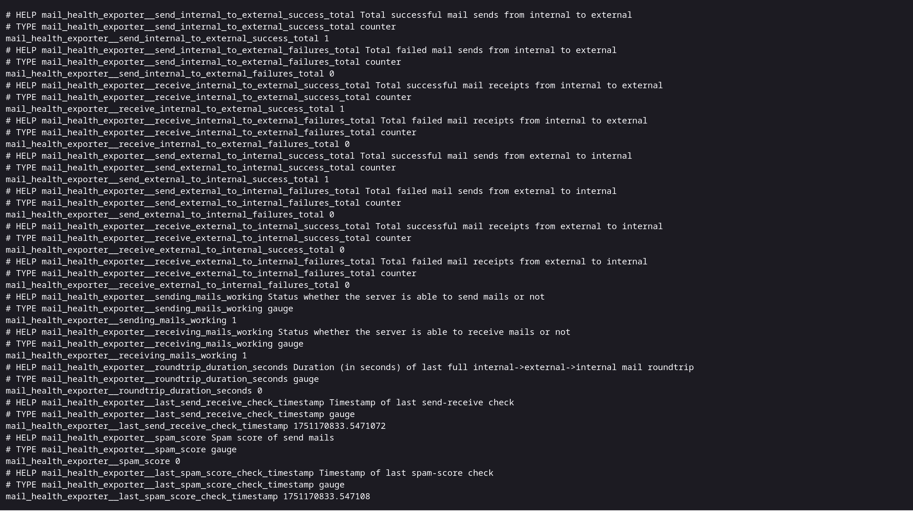
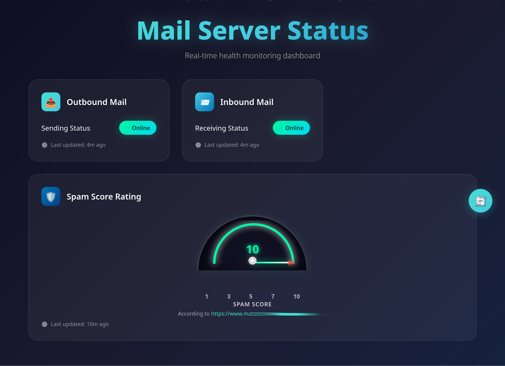

# mail-health-exporter
[](https://hub.docker.com/r/mezorian/mail-health-exporter)

A simple prometheus exporter that reports about the health of your mail-server!

The health-check is a 2 steps process:

1. Do a send-receive check
2. Check the spam-score of sent messages

<p float="left">
  
  
</p>

## Table of Contents

- [Overview](#overview)
  - [Send-Receive Check](#send-receive-check)
  - [Spam-Score Check](#spam-score-check)
- [Quick Start](#quick-start)
  - [Prerequisites](#prerequisites)
  - [Deployment Options](#deployment-options)
    - [Option 1: Docker Compose with Environment Variables](#option-1-docker-compose-with-environment-variables)
    - [Option 2: Portainer with Docker Secrets](#option-2-portainer-with-docker-secrets)
  - [Password Configuration](#password-configuration)
  - [Logs](#logs)
  - [Health Check](#health-check)
  - [Troubleshooting](#troubleshooting)
    - [Common Issues](#common-issues)
- [Security Considerations](#security-considerations)
- [Monitoring Endpoints](#monitoring-endpoints)
  - [Metrics Endpoint](#metrics-endpoint)
  - [Status Endpoint](#status-endpoint)
- [Prometheus Alerts for alertmanager](#prometheus-alerts-for-alertmanager)

## Overview

The **Mail-Health-Exporter** checks the status of your mail server by performing two main health-checks:

### Send-Receive Check

The **Send-Receive Check** runs a roundtrip mail test between an internal and an external server. It performs the following steps:

1. Send a test email from internal to external.
2. Check if the email was received on the external server.
3. Delete the email from the external mailbox.
4. Send a test email from external to internal.
5. Check if the email was received on the internal server.
6. Delete the email from the internal mailbox.
7. Record the total roundtrip duration as a metric.

### Spam-Score Check

The **Spam-Score Check** tests the spam score of sent emails by sending them to a spam testing service:

1. Ensures at least 8 hours have passed since the last test.
2. Sends a test email to a spam testing service.
3. Retrieves and records the spam score.
4. Updates the timestamp of the last test.

The **8-hour rate limit** ensures no excessive API calls to the spam service while providing regular monitoring of email deliverability.

After each health-check the program will export its results in two formats:
- **Prometheus metrics** at http://localhost:9091/metrics for monitoring systems
- **Web dashboard** at http://localhost:9091/status showing a human-readable status page


The health-check is performed every 5 minutes, the spam-score check only every 8 hours.

This repo also provides prometheus alertrules which can be used to get automatically notified 
(i.e. by email) when the mail-health-exporter reported some failed send or receive tests, if 
mail-round-trip times are too high, or if the spamscore has decreased.

## Quick Start

### Prerequisites

- Docker and Docker Compose (Option 1) or Portainer (Option 2) installed
- Email accounts configured for monitoring on both internal (your server) and external servers (e.g. gmail.com or others)

### Deployment Options

#### Option 1: Docker Compose with Environment Variables

This approach stores passwords directly in environment variables (simpler but less secure).

##### 1. Prepare the Configuration

Copy `docker-compose.template.yml` to `docker-compose.yml`:

```bash
cp docker-compose.template.yml docker-compose.yml
```

##### 2. Edit the Configuration

Open `docker-compose.yml` and make the following changes:

1. **Remove the secrets section**:
   ```yaml
   # COMMENT/DISABLE THESE LINES:
   secrets:
     internal_email_password:
       external: true
     external_email_password:
       external: true
   ```

2. **Remove secrets from the service**:
   ```yaml
   # COMMENT/DISABLE THESE LINES:
   secrets:
     - internal_email_password
     - external_email_password
   ```

3. **Uncomment and configure the password environment variables**:
   ```yaml
   - INTERNAL_EMAIL_PASSWORD=your_internal_email_password_here
   - EXTERNAL_EMAIL_PASSWORD=your_external_email_password_here
   ```

4. **Update all configuration values**:
   ```yaml
   # Internal mail server
   - INTERNAL_SMTP_SERVER=your-internal-server.com
   - INTERNAL_EMAIL_ADDRESS=monitoring@your-internal-server.com
   
   # External mail server (example with Gmail)
   - EXTERNAL_SMTP_SERVER=smtp.gmail.com
   - EXTERNAL_EMAIL_ADDRESS=your-external-email@gmail.com
   ```

##### 3. Deploy

```bash
docker-compose up -d
```

##### 4. Verify Deployment

Check that the service is running:
```bash
docker-compose ps
docker-compose logs mail-health-exporter
```

Access the monitoring interfaces:
- **Metrics**: `http://localhost:9091/metrics`
- **Status Dashboard**: `http://localhost:9091/status`

---

#### Option 2: Portainer with Docker Secrets

This approach uses Docker secrets for secure password management.

##### 1. Create Docker Secrets

In Portainer, navigate to **Secrets** and create two new secrets:

1. **Secret Name**: `internal_email_password`
   - **Secret**: Your internal email password

2. **Secret Name**: `external_email_password`
   - **Secret**: Your external email password

##### 2. Create the Stack

1. Go to **Stacks** in Portainer
2. Click **Add stack**
3. Name your stack (e.g., `mail-health-exporter`)
4. Paste the contents of `docker-compose.template.yml`
5. **Configure the environment variables** in the stack configuration:
   ```yaml
   # Internal mail server
   - INTERNAL_SMTP_SERVER=your-internal-server.com
   - INTERNAL_EMAIL_ADDRESS=monitoring@your-internal-server.com
   
   # External mail server (example with Gmail)
   - EXTERNAL_SMTP_SERVER=smtp.gmail.com
   - EXTERNAL_EMAIL_ADDRESS=your-external-email@gmail.com
   ```

##### 3. Deploy the Stack

Click **Deploy the stack**

##### 4. Verify Deployment

1. Check the stack status in Portainer
2. View container logs
3. Access the monitoring interfaces:
   - **Metrics**: `http://localhost:9091/metrics`
   - **Status Dashboard**: `http://localhost:9091/status`

### Password Configuration

**With Docker Secrets** (recommended):
- Passwords are read from `/run/secrets/internal_email_password` and `/run/secrets/external_email_password`
- Secrets must be named exactly `internal_email_password` and `external_email_password`

**With Environment Variables** (simpler, but less secure):
- Set `INTERNAL_EMAIL_PASSWORD` and `EXTERNAL_EMAIL_PASSWORD` environment variables
- Remove the secrets section from docker-compose.yml

### Logs

View container logs:
```bash
# Docker Compose
docker-compose logs -f mail-health-exporter

# Portainer
# View logs through the Portainer web interface
```

### Health Check

The container includes a health check that verifies the metrics endpoint is accessible:
```bash
docker-compose ps  # Shows health status
```

You can also manually verify both endpoints are working:
```bash
# Check metrics endpoint
curl http://localhost:9091/metrics

# Check status dashboard (returns HTML)
curl http://localhost:9091/status
```

### Troubleshooting

#### Common Issues

1. **Authentication Failures**:
   - Verify email credentials
   - Check if 2FA is enabled (use app passwords for Gmail)
   - Ensure IMAP/SMTP access is enabled

2. **Connection Issues**:
   - Verify server hostnames and ports
   - Check firewall rules
   - Confirm TLS settings

3. **Container Won't Start**:
   - Check Docker logs: `docker-compose logs mail-health-exporter`
   - Verify all required environment variables are set
   - Ensure secrets are properly created (if using Docker secrets)

4. **Web Interface Issues**:
   - Verify port 9091 is accessible and not used by any other service
   - Check firewall rules for HTTP access
   - Ensure the service is healthy using `docker-compose ps`

## Security Considerations

- **Use Docker Secrets** when possible for production deployments
- **Restrict network access** to the monitoring ports (9091) - consider using a reverse proxy like for example nginx
- **Use dedicated monitoring email accounts** with minimal privileges
- **Regularly rotate passwords** used for monitoring
- **Monitor the monitoring service** - set up alerts for when this service fails
- **Secure the web dashboard** - consider adding authentication if exposing publicly

## Monitoring Endpoints

The service provides two HTTP endpoints:

- **`/metrics`** - Prometheus exposition format for scraping by monitoring systems
- **`/status`** - Web dashboard displaying:
  - Whether the mail-server is able to send messages
  - Whether the mail-server is able to receive messages
  - Current spam-score of sent messages by the server

### Metrics Endpoint 
The metrics endpoint is providing scrapable data in the Prometheus exposition format.
It provides machine-readable info about whether the mail-server is currently able 
to send and receive emails to/from outside mail-servers. 
The following section shows how this data looks in detail. 

```bash
# HELP mail_health_exporter__send_internal_to_external_success_total Total successful mail sends from internal to external
# TYPE mail_health_exporter__send_internal_to_external_success_total counter
mail_health_exporter__send_internal_to_external_success_total 1
# HELP mail_health_exporter__send_internal_to_external_failures_total Total failed mail sends from internal to external
# TYPE mail_health_exporter__send_internal_to_external_failures_total counter
mail_health_exporter__send_internal_to_external_failures_total 0
# HELP mail_health_exporter__receive_internal_to_external_success_total Total successful mail receipts from internal to external
# TYPE mail_health_exporter__receive_internal_to_external_success_total counter
mail_health_exporter__receive_internal_to_external_success_total 1
# HELP mail_health_exporter__receive_internal_to_external_failures_total Total failed mail receipts from internal to external
# TYPE mail_health_exporter__receive_internal_to_external_failures_total counter
mail_health_exporter__receive_internal_to_external_failures_total 0
# HELP mail_health_exporter__send_external_to_internal_success_total Total successful mail sends from external to internal
# TYPE mail_health_exporter__send_external_to_internal_success_total counter
mail_health_exporter__send_external_to_internal_success_total 1
# HELP mail_health_exporter__send_external_to_internal_failures_total Total failed mail sends from external to internal
# TYPE mail_health_exporter__send_external_to_internal_failures_total counter
mail_health_exporter__send_external_to_internal_failures_total 0
# HELP mail_health_exporter__receive_external_to_internal_success_total Total successful mail receipts from external to internal
# TYPE mail_health_exporter__receive_external_to_internal_success_total counter
mail_health_exporter__receive_external_to_internal_success_total 0
# HELP mail_health_exporter__receive_external_to_internal_failures_total Total failed mail receipts from external to internal
# TYPE mail_health_exporter__receive_external_to_internal_failures_total counter
mail_health_exporter__receive_external_to_internal_failures_total 0
# HELP mail_health_exporter__sending_mails_working Status whether the server is able to send mails or not
# TYPE mail_health_exporter__sending_mails_working gauge
mail_health_exporter__sending_mails_working 1
# HELP mail_health_exporter__receiving_mails_working Status whether the server is able to receive mails or not
# TYPE mail_health_exporter__receiving_mails_working gauge
mail_health_exporter__receiving_mails_working 1
# HELP mail_health_exporter__roundtrip_duration_seconds Duration (in seconds) of last full internal->external->internal mail roundtrip
# TYPE mail_health_exporter__roundtrip_duration_seconds gauge
mail_health_exporter__roundtrip_duration_seconds 0
# HELP mail_health_exporter__last_send_receive_check_timestamp Timestamp of last send-receive check
# TYPE mail_health_exporter__last_send_receive_check_timestamp gauge
mail_health_exporter__last_send_receive_check_timestamp 1751170833.5471072
# HELP mail_health_exporter__spam_score Spam score of send mails
# TYPE mail_health_exporter__spam_score gauge
mail_health_exporter__spam_score 0
# HELP mail_health_exporter__last_spam_score_check_timestamp Timestamp of last spam-score check
# TYPE mail_health_exporter__last_spam_score_check_timestamp gauge
mail_health_exporter__last_spam_score_check_timestamp 1751170833.547108
```

### Status Endpoint
The status endpoint provides a human-readable dashboard that shows:
1. Whether the mail-server is able to send mails 
2. Whether the mail-server is able to receive mails 
3. The current spam score of a mail sent by the mail-server

For each information there is also a time-indicator shown that reports on how old this information is.


## Prometheus Alerts for alertmanager
If you want to get automatically notified (e.g. by e-mail) if your mail-health-exporter exported metrics
that might observer misbehavior of your mail-server you can configure your prometheus with some alert-rules 
for mail-health-exporter. Some pre-configured alert-rules for prometheus can be found at [alert_rules.yml](alert_rules.yml)

For how to use alertmanager with prometheus please refer to https://github.com/prometheus/alertmanager


